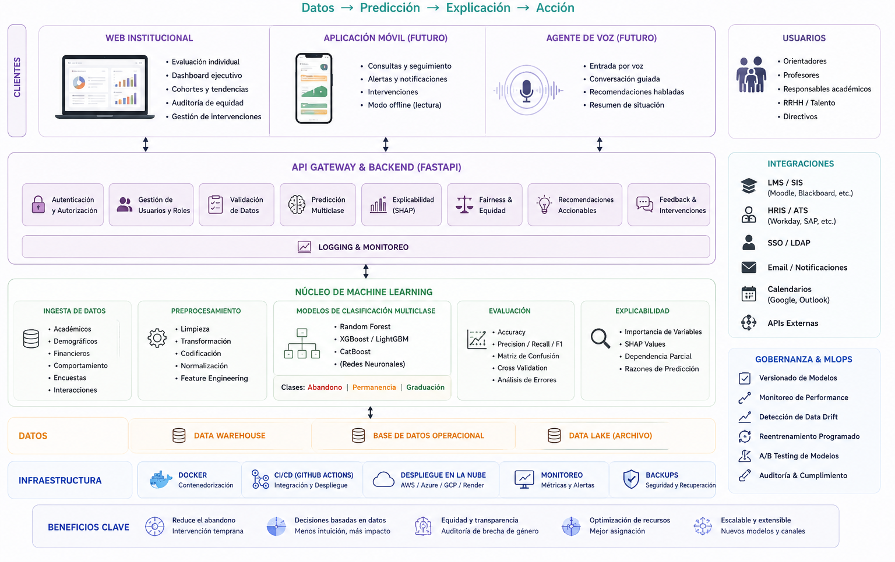
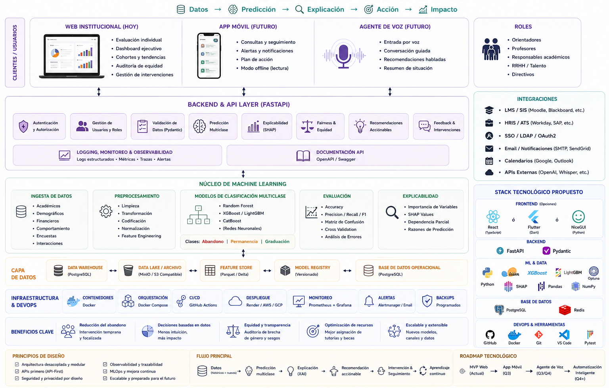

### Desarrollo sobre Modelos Ensemble

## Descripción

TalentCare AI es una plataforma de inteligencia de talento que utiliza modelos de ensemble machine learning para predecir patrones relacionados con la satisfacción laboral y el desarrollo profesional en el sector tecnológico. Mediante el análisis de miles de perfiles de desarrolladores, identifica diferencias en representación, progresión de carrera y bienestar entre hombres y mujeres, proporcionando a las empresas información basada en datos para impulsar estrategias de retención e inclusión más efectivas.

La aplicación también tiene una utilidad social para entidades sociales e instituciones públicas que deseen instaurar mejoras en el área de orientación sociolaboral que pueden ser de utilidad en acompañamientos en el sector social para mejorar esta realidad, como por ejemplo mejorando programas de sensibilización en diversas áreas y proyectos. 

 Además, para las instituciones públicas, como responsables de instaurar políticas y medidas que impulsen la equidad de género, también se conviete en una herramienta de gran utilidad que favorezca este impulso.


 





## Árbol de carpetas

```
|   .dockerignore
|   .env.example
|   .gitignore
|   .python-version
|   ANEXOS.md
|   docker-compose.yml
|   main.py
|   pyproject.toml
|   README.md
|   __init__.py
|   
+---.github
|   \---workflows
|           ci.yml
|           proyecto6-grupo2.yml
|           
+---backend
|   |   Dockerfile
|   |   
|   \---app
|           inference.py
|           main.py
|           routes.py
|           schemas.py
|           __init__.py
|           
+---data
|   +---processed
|   \---raw
+---docs
|   \---SDD
|           00_scope.md
|           01_requirements.md
|           02_architecture.md
|           03_implementation_structure.md
|           04_data_pipeline.md
|           05_modeling.md
|           06_frontend.md
|           07_api.md
|           08_testing.md
|           09_deployment
|           
+---frontend
|   |   Dockerfile
|   |   package.json
|   |   vite.config.ts
|   |   
|   \---src
|           app.tsx
|           main.tsx
|           
+---models
|   +---metrics
|   |       .gitkeep
|   |       
|   +---pipelines
|   |       .gitkeep
|   |       
|   \---trained
|           .gitkeep
|           
+---notebooks
|       eda.py
|       
+---scripts
|       evaluate.py
|       predict.py
|       preprocess.py
|       train.py
|       
+---src
|   |   __init__.py
|   |   
|   +---data
|   |       loader.py
|   |       preprocessing.py
|   |       split.py
|   |       validation.py
|   |       
|   +---evaluation
|   |       compare.py
|   |       evaluate.py
|   |       metrics.py
|   |       plots.py
|   |       
|   +---features
|   |       engineering.py
|   |       selection.py
|   |       
|   +---inference
|   |       load_pipeline.py
|   |       predict.py
|   |       
|   \---training
|           baseline.py
|           common.py
|           ensemble.py
|           random_forest.py
|           train.py
|           tuning.py
|           xgboost.py
|           
\---tests
        test_backend.py
        test_data.py
        test_evaluation.py
        test_inference.py
        test_training.py
        
```

## Equipo AGIL SCRUM

- Karina: Developer
- Gabriela: Developer
- Anahí: Product owner y developer
- Veru: Scrum Master y developer

## Estructura del trabajo

- Todo centralizado en GitHub
- Projects: Contiene el backlog del proyecto con un roadmap candelarizado
- Wiki: contiene sprints y dailies 
