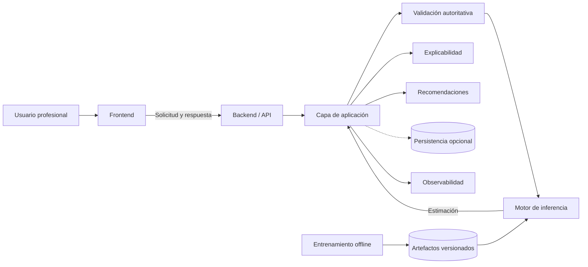
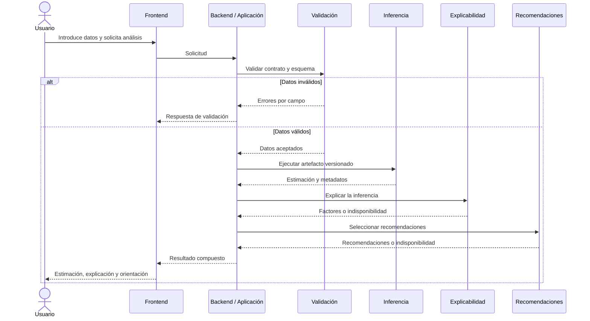

# Software Design Document (SDD)

# SDD-02 · Arquitectura del sistema

| Campo | Valor |
|---|---|
| Proyecto | TalentCare *(nombre provisional)* |
| Documento | Arquitectura del sistema |
| Código | SDD-02 |
| Versión | 1.1 |
| Estado | Draft |
| Última actualización | Julio 2026 |
| Documentos de origen | SDD-00 · Project Scope; SDD-00A · Casos de uso; SDD-01 · Requirements |
| Documentos relacionados | SDD-03 a SDD-09 |

---

## 1. Propósito y alcance

Define la arquitectura lógica de TalentCare: límites, componentes, flujos, contratos y decisiones que condicionan la implementación.

No redefine alcance, casos de uso, requisitos, API, interfaz, pruebas ni despliegue. Esos detalles permanecen en sus SDD responsables.

La arquitectura descrita es el objetivo del MVP. La presencia de directorios o archivos vacíos en el repositorio no implica que un componente esté implementado.

---

## 2. Principios arquitectónicos

| Principio | Decisión aplicada |
|---|---|
| Separación de responsabilidades | Frontend, aplicación, validación, inferencia, explicabilidad, recomendaciones y observabilidad tienen límites propios. |
| Modularidad y cohesión | Cada módulo concentra una responsabilidad y expone un contrato reducido. |
| Bajo acoplamiento | La interfaz depende del contrato del backend, no del modelo ni de sus librerías. |
| Intercambiabilidad | El motor carga un paquete versionado de pipeline, modelo, esquema y metadatos. |
| Reproducibilidad | Entrenamiento e inferencia comparten transformaciones versionadas. |
| Testabilidad | Los límites admiten sustitución por dobles de prueba y validación aislada. |
| Trazabilidad | Cada inferencia identifica versiones de esquema, pipeline y modelo. |
| Fail-safe | Una salida inválida no se presenta como resultado válido. |
| Seguridad y privacidad por diseño | Validación autoritativa, minimización, secretos externos y logs sin datos sensibles. |
| Human-in-the-loop | El sistema informa; una persona interpreta y decide. |
| Evolución incremental | Persistencia, autenticación y servicios separados se incorporan solo tras aprobación. |

---

## 3. Contexto y estado del sistema

### 3.1 Límites

| Dentro del sistema | Fuera del sistema |
|---|---|
| Interfaz web, backend, aplicación, validación, inferencia, explicabilidad, recomendaciones y observabilidad | Usuario profesional, fuentes de datos, proceso organizativo de decisión y futuras integraciones corporativas |

El sistema genera estimaciones y evidencia para revisión humana. No ejecuta decisiones laborales.

### 3.2 Estado arquitectónico

| Estado | Alcance |
|---|---|
| Respaldado por el repositorio | Límites `frontend/`, `backend/` y `src/`; módulos iniciales de datos, entrenamiento, evaluación e inferencia |
| Especificado, no necesariamente implementado | Orquestación completa, contratos, explicabilidad, recomendaciones, observabilidad y persistencia desacoplada |
| Pendiente | Stack definitivo, modelo activo, variable objetivo, dataset, base de datos, autenticación y topología de despliegue |

`JobSat` permanece como posible variable candidata o proxy. No condiciona la arquitectura ni se considera target confirmado.

---

## 4. Arquitectura de alto nivel



La API es la frontera del backend. La capa de aplicación orquesta; no contiene transformaciones del modelo. Entrenamiento e inferencia son flujos separados.

---

## 5. Componentes y responsabilidades

| Componente | Responsabilidad | Entradas | Salidas | Dependencias | Límite |
|---|---|---|---|---|---|
| Frontend | Captura, validación inicial, estados y presentación | Acción del usuario; respuesta del backend | Solicitud; interfaz de resultado o error | API | No ejecuta ML, explicaciones ni recomendaciones |
| Backend / API | Frontera, validación de contrato y respuesta | Solicitud del frontend | Respuesta o error normalizado | Aplicación; observabilidad | No define lógica visual ni modelo |
| Capa de aplicación | Orquestar análisis y estados | Datos validados por contrato | Resultado compuesto | Validación; inferencia; XAI; recomendaciones; persistencia | No duplica responsabilidades de dominio |
| Validación autoritativa | Verificar esquema, tipos, categorías y rangos | Solicitud | Datos aceptados o errores por campo | Esquema versionado | Frontend no sustituye esta validación |
| Pipeline de inferencia | Convertir datos válidos en features | Datos compatibles | Vector o estructura transformada | Artefacto versionado | Mismas transformaciones que entrenamiento |
| Motor de inferencia | Ejecutar el modelo activo | Features transformadas | Estimación y metadatos | Modelo; pipeline | No decide presentación ni acción laboral |
| Artefactos de modelo | Agrupar pipeline, modelo, esquema, clases y metadatos | Salida de entrenamiento aprobada | Paquete cargable y versionado | Repositorio de artefactos | No contiene datos de usuario |
| Explicabilidad | Explicar una inferencia concreta | Entrada, salida y contexto del modelo | Factores o indisponibilidad | Método compatible con el modelo | No atribuye causalidad |
| Recomendaciones | Seleccionar orientación trazable | Resultado y explicación válida | Recomendaciones o indisponibilidad | Lógica aprobada | No genera órdenes ni decisiones |
| Persistencia | Aislar almacenamiento opcional | Registros autorizados | Datos recuperables según política | Motor por decidir | No es obligatoria para el flujo base |
| Observabilidad | Registrar salud, errores, latencia y trazas técnicas | Eventos y metadatos mínimos | Logs y métricas | Todos los componentes | No registra datos sensibles innecesarios |
| Entrenamiento offline | Preparar datos, comparar y versionar modelos | Datos fuente aprobados | Artefactos candidatos y evidencia | Data Pipeline; Modeling | No se ejecuta dentro de una inferencia |

---

## 6. Datos, entrenamiento e inferencia

### 6.1 Conceptos separados

| Elemento | Definición arquitectónica |
|---|---|
| Datos fuente | Edición o combinación aprobada; permanece fuera del flujo online |
| Variables disponibles | Columnas presentes antes de selección y transformación |
| Variable objetivo candidata | Fenómeno de modelado pendiente de validación |
| Features transformadas | Representación producida por el pipeline versionado |
| Artefacto de modelo | Paquete inmutable de pipeline, modelo, esquema y metadatos |
| Resultado de inferencia | Estimación validada, nunca una decisión laboral |

### 6.2 Separación de flujos

| Entrenamiento | Inferencia |
|---|---|
| Opera offline sobre datos aprobados | Opera online sobre una solicitud válida |
| Compara modelos y ensembles | Carga una versión aprobada |
| Produce artefactos versionados | Consume artefactos sin modificarlos |
| Evalúa rendimiento, errores y fairness | Devuelve estimación y metadatos |
| Puede publicar una nueva versión | No reentrena ni incorpora entradas automáticamente |

La capa de ML no fija algoritmo. Debe admitir modelos simples, ensembles y sustitución del modelo activo mediante el mismo contrato.

La monitorización futura podrá detectar drift y degradación. No forma parte del entrenamiento continuo ni se considera implementada.

### 6.3 Flujo de inferencia



Si no existe una estimación válida, el flujo termina en error. Las combinaciones parciales admitidas permanecen pendientes y deberán definirse en SDD-07 y SDD-08.

---

## 7. Interfaces y contratos

| Frontera | Entrada | Salida | Regla |
|---|---|---|---|
| Frontend → API | Datos del formulario | Aceptación o error normalizado | Solo campos del esquema publicado |
| API → Aplicación | Solicitud validada por contrato | Resultado compuesto | La aplicación conserva un identificador técnico de operación |
| Aplicación → Inferencia | Datos validados | Estimación; versión de modelo; estado | Rechaza esquemas y salidas desconocidos |
| Inferencia → Explicabilidad | Contexto de la misma ejecución | Factores o indisponibilidad | No mezcla versiones ni solicitudes |
| Aplicación → Recomendaciones | Estimación y explicación disponible | Orientación o indisponibilidad | Lógica trazable y no prescriptiva |
| Aplicación → Persistencia | Registro mínimo autorizado | Confirmación o error | Solo si existe política aprobada |
| Componentes → Observabilidad | Eventos técnicos mínimos | Log, métrica o traza | Sin payload sensible |
| Entrenamiento → Artefactos | Paquete candidato aprobado | Versión publicable | Incluye esquema y metadatos compatibles |

Los campos, endpoints, códigos y formatos definitivos pertenecen a **SDD-07 · API**.

---

## 8. Persistencia y trazabilidad

### 8.1 Decisión de diseño

La lógica de negocio dependerá de una abstracción de persistencia, no de un motor concreto. El flujo base podrá operar sin base de datos.

El proyecto contempla incorporar una base de datos, pero motor, esquema, retención y alcance permanecen pendientes.

### 8.2 Datos potencialmente persistibles

| Categoría | Condición |
|---|---|
| Entradas de inferencia minimizadas o anonimizadas | Solo con finalidad, autorización y retención aprobadas |
| Resultado, versión del modelo y marca temporal | Solo si se aprueba trazabilidad persistente |
| Métricas operativas | Agregadas o sin identificación innecesaria |
| Feedback e historial | Fuera del MVP mientras no cambie el alcance |
| Auditoría técnica | Metadatos mínimos; sin payload completo por defecto |

No deberán persistirse identificadores personales innecesarios, secretos, datos sensibles sin justificación ni entradas completas en logs.

Cada inferencia trazable deberá poder relacionar, sin identificar innecesariamente a una persona:

```text
operación → esquema → pipeline → modelo → resultado → explicación → recomendación
```

---

## 9. Seguridad, privacidad y auditoría

| Área | Mecanismo arquitectónico |
|---|---|
| Entrada | Validación autoritativa y lista permitida de campos |
| Datos | Minimización, tratamiento temporal y separación de finalidad |
| Secretos | Configuración externa al código y al cliente |
| Componentes | Acceso limitado a las dependencias necesarias |
| Errores | Respuestas normalizadas sin trazas ni detalles internos |
| Logs | Eventos estructurados sin datos sensibles innecesarios |
| Artefactos | Versionado, integridad y compatibilidad antes de carga |
| Retención | Política explícita y eliminación verificable antes de persistir |

El MVP no requiere autenticación. Si se incorpora, la autenticación y autorización por roles deberán situarse en la frontera de acceso y aplicarse también en backend. Roles, permisos y proveedor permanecen pendientes.

La arquitectura no implementa una acción automática de contratación, despido, promoción, sanción, evaluación o exclusión.

---

## 10. Observabilidad y operación

| Señal | Contenido mínimo | Estado |
|---|---|---|
| Logs estructurados | Etapa, tipo de error, estado e identificador técnico | Prevista |
| Métricas técnicas | Latencia, errores, disponibilidad y volumen | Umbrales pendientes |
| Trazabilidad de inferencia | Versiones de esquema, pipeline y modelo | Prevista |
| Health checks | Estado de componentes desplegados | Depende de topología |
| Rendimiento del modelo | Métricas posteriores al despliegue | Evolución prevista |
| Drift | Cambios en datos y comportamiento | Evolución prevista |

Herramientas, alertas, paneles y umbrales se definirán en **SDD-08 · Testing** y **SDD-09 · Deployment**.

---

## 11. Decisiones arquitectónicas

| ID | Decisión | Motivo | Consecuencia | Estado |
|---|---|---|---|---|
| AD-001 | Arquitectura modular por capas | Separar responsabilidades | Sustitución y pruebas aisladas | Aprobada |
| AD-002 | API como frontera del backend | Aislar cliente y dominio | Frontend no conoce ML | Aprobada |
| AD-003 | Entrenamiento separado de inferencia | Evitar acoplamiento y reentrenamiento online | Publicación explícita de artefactos | Aprobada |
| AD-004 | Pipeline compartido y versionado | Mantener paridad | Modelo y transformación se despliegan juntos | Aprobada |
| AD-005 | Modelo intercambiable | Algoritmo y target no están cerrados | Contrato estable de inferencia | Aprobada |
| AD-006 | Explicabilidad como componente independiente | Compatibilidad con distintos modelos | Método concreto pendiente | Provisional |
| AD-007 | Human-in-the-loop obligatorio | Evitar decisiones laborales automáticas | La salida siempre requiere interpretación | Aprobada |
| AD-008 | Persistencia desacoplada y opcional | Mantener el flujo base sin histórico | Base de datos sustituible | Provisional |
| AD-009 | Inferencia integrada o servicio independiente | Balance entre simplicidad y aislamiento | Cambia topología y operación | Pendiente |
| AD-010 | Motor y esquema de base de datos | No existe decisión respaldada | Impide cerrar persistencia | Pendiente |
| AD-011 | Autenticación y autorización por roles | No son obligatorias en el MVP | Se mantiene una frontera extensible | Pendiente |
| AD-012 | Stack tecnológico definitivo | Los placeholders no prueban adopción completa | Requiere validación en SDD-03 | Pendiente |
| AD-013 | Resultados parciales admitidos | Evitar interpretaciones inválidas | Debe coordinar API y pruebas | Pendiente |
| AD-014 | Observabilidad avanzada y drift | Requiere operación y datos reales | Evolución incremental | Provisional |

---

## 12. Riesgos, limitaciones y pendientes

| Riesgo o limitación | Impacto | Tratamiento arquitectónico |
|---|---|---|
| Dataset y objetivo sin cerrar | Contrato y modelo pueden cambiar | Esquemas y artefactos versionados |
| Componentes aún incompletos | Diferencia entre diseño e implementación | Validación progresiva contra SDD-03 |
| Divergencia entre entrenamiento e inferencia | Predicciones inválidas | Pipeline compartido y pruebas de paridad |
| Persistencia de datos sensibles | Riesgo de privacidad | Abstracción, minimización y decisión previa |
| Explicador incompatible | Resultado sin evidencia válida | Estado explícito de indisponibilidad |
| Recomendación perjudicial | Riesgo humano y reputacional | Lógica revisable, trazable y no prescriptiva |
| Acoplamiento a un modelo | Dificulta sustitución | Contrato estable y artefacto intercambiable |
| Falta de métricas operativas | Fallos no detectados | Observabilidad mínima antes del despliegue |

Decisiones funcionales y de modelado permanecen en las OD de **SDD-01 · Requirements**. No se duplican aquí.

---

## 13. Trazabilidad con requisitos

| Área arquitectónica | Requisitos relacionados | Mecanismo |
|---|---|---|
| Frontend | FR-001 a FR-007; FR-019 a FR-030; NFR-005 a NFR-010 | Cliente desacoplado y estados explícitos |
| API y aplicación | FR-008 a FR-019; FR-031; SEC-001; SEC-005 | Validación autoritativa y orquestación |
| Datos y pipeline | DR-001 a DR-011; MLR-015 | Esquema y transformaciones versionados |
| Entrenamiento y modelo | MLR-001 a MLR-014 | Flujo offline y artefacto intercambiable |
| Explicabilidad | FR-025 a FR-027; XR-001 a XR-005 | Componente vinculado a la inferencia |
| Recomendaciones | FR-028; FR-029; XR-006 a XR-008 | Lógica trazable y control de indisponibilidad |
| Supervisión humana | HR-001 a HR-007 | Separación entre estimación y decisión |
| Persistencia | PR-001 a PR-005 | Puerto desacoplado y política previa |
| Seguridad | SEC-001 a SEC-006 | Validación, secretos externos y límites de acceso |
| Fairness | FAIR-001 a FAIR-007 | Evidencia de evaluación asociada al modelo |
| Observabilidad | OBS-001 a OBS-006; NFR-001 a NFR-004 | Logs, métricas, correlación y recuperación |
| Testabilidad | NFR-011 a NFR-015 | Módulos sustituibles y contratos verificables |

La trazabilidad detallada con implementación, API, pruebas y despliegue corresponde a SDD-03, SDD-07, SDD-08 y SDD-09.
