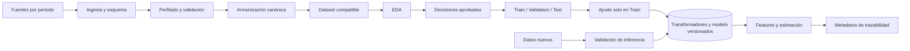

# Software Design Document (SDD)

# SDD-04 · Data Pipeline

| Campo | Valor |
|---|---|
| Proyecto | TalentCare *(nombre provisional)* |
| Documento | Data Pipeline |
| Código | SDD-04 |
| Versión | 1.1 |
| Estado | Draft |
| Última actualización | Julio 2026 |
| Documentos de origen | SDD-00 a SDD-03 |
| Documentos relacionados | SDD-05; SDD-08; SDD-09 |

## 1. Propósito y límites

Define el pipeline multianual de ingesta, validación, armonización, transformación y artefactos. No documenta EDA, modelado, API, pruebas ni despliegue.

La selección de datos y la variable objetivo permanecen pendientes. El pipeline no dependerá de un periodo concreto.

## 2. Flujo general

EDA produce evidencia; no es una dependencia productiva. Solo las transformaciones aprobadas se incorporan a `src/`.

## 3. Etapas y estado

| Etapa | Entrada → salida | Implementación actual | Estado |
|---|---|---|---|
| Ingesta y esquema | Periodo → datos y metadatos | `RawData.download()` y `Schema.download()` | Implementado |
| Perfilado y comparación | Ediciones → inventario de diferencias | Análisis disperso; sin comparador | Parcial |
| Validación | Datos crudos → datos aceptados o errores | `src/data/validation.py` vacío | Pendiente |
| Limpieza y normalización | Datos válidos → datos normalizados | `src/data/preprocessing.py` | Parcial |
| Armonización | Ediciones normalizadas → esquema canónico | Sin implementación | Pendiente |
| Features | Dataset compatible → features candidatas | `src/features/engineering.py` | Parcial |
| Partición y ajuste | Dataset → splits y transformador | `split.py` vacío; transformador incompleto | Pendiente |
| Artefactos e inferencia | Pipeline aprobado → salida compatible | `models/` y `src/inference/` vacíos | Pendiente |

`RawData.load()` y `Schema.load()` existen, pero streaming no es el flujo aprobado; su continuidad sigue pendiente.

## 4. Armonización multianual

Cada edición deberá inventariarse y mapearse a un esquema canónico versionado. El mapeo registrará origen, destino, transformación, compatibilidad semántica y periodos aplicables.

| Categoría | Función | Tratamiento |
|---|---|---|
| Identificadores | Control técnico | Excluir de features salvo justificación |
| Procedencia | Trazar fuente y periodo | Conservar como metadato |
| Variables comunes | Base comparable | Normalizar tipo, dominio y significado |
| Variables exclusivas | Diferencias entre ediciones | Excluir, mantener o derivar según decisión |
| Variables derivadas | Representación reutilizable | Generar con transformación versionada |
| Variables sensibles | Auditoría y fairness | Inventariar; uso sujeto a aprobación |
| Target candidato | Posible fenómeno de modelado | Validar disponibilidad, calidad y semántica |
| Metadatos | Linaje y reproducibilidad | Separar de las features |

Una coincidencia de nombre no implica equivalencia semántica.

## 5. Entrenamiento, inferencia y leakage

| Flujo | Ajuste permitido | Artefacto |
|---|---|---|
| EDA | Solo exploratorio | Ninguno productivo |
| Entrenamiento | Únicamente con train | Pipeline candidato |
| Validation/Test | No | Pipeline ajustado en train |
| Inferencia | Nunca | Pipeline y modelo persistidos |

- Separar train, validation y test antes de cualquier ajuste dependiente de datos.
- Ajustar imputación, codificación, escalado y selección solo con train.
- Aplicar el transformador persistido, sin `fit`, a validation, test e inferencia.
- Excluir target, derivados del target y datos no disponibles al inferir.
- Versionar conjuntamente esquema, transformador y modelo.

## 6. Artefactos y reproducibilidad

| Ruta o artefacto | Contenido | Estado |
|---|---|---|
| `data/processed/` | Dataset preparado | Vacío |
| `models/pipelines/` | Transformadores persistidos | Vacío |
| `models/trained/` | Modelos aprobados | Vacío |
| `models/metrics/` | Resultados de evaluación | Vacío |
| Metadatos de dataset | Fuente, periodos, versión, huella y esquema | Pendiente |
| Metadatos de ejecución | Código, configuración, semilla y timestamp | Pendiente |
| Metadatos de inferencia | Versiones de esquema, pipeline y modelo | Pendiente |

Formato, nomenclatura y almacenamiento permanecen pendientes. No se define aquí un sistema MLOps.

## 7. Riesgos y decisiones pendientes

### 7.1 Riesgos

| ID | Riesgo | Mitigación | Estado |
|---|---|---|---|
| DP-R01 | Cambios de esquema o significado | Inventario, mapeo y validación semántica | Abierto |
| DP-R02 | Polars y Pandas sin frontera aprobada | Definir formato canónico y conversión única | Abierto |
| DP-R03 | Periodo, rutas y target fijados en código | Sustituir por configuración aprobada | Abierto |
| DP-R04 | EDA y transformación reutilizable mezclados | Visualización en notebooks; lógica en `src/` | Parcial |
| DP-R05 | Validación, split, artefactos e inferencia son placeholders | Implementar con contratos versionados | Abierto |
| DP-R06 | Leakage o uso inadecuado de variables sensibles | Encapsular ajuste y auditar features | Abierto |
| DP-R07 | Dependencias e imports no reproducibles | Alinear paquetes, exports y lockfile | Abierto |

### 7.2 Decisiones

| ID | Decisión pendiente | Responsable |
|---|---|---|
| DP-01 | Edición o combinación de ediciones | SDD-04 / SDD-05 |
| DP-02 | Esquema canónico y compatibilidad | SDD-04 |
| DP-03 | Variable objetivo y cobertura | SDD-05 |
| DP-04 | Frontera Polars/Pandas | SDD-03 / SDD-04 |
| DP-05 | Transformaciones aprobadas y tratamiento de nulos/categorías | SDD-04 / SDD-05 |
| DP-06 | Estrategia de partición temporal | SDD-04 / SDD-05 |
| DP-07 | Formato, versión y almacenamiento de artefactos | SDD-04 / SDD-05 / SDD-09 |
| DP-08 | Tratamiento de variables sensibles y proxies | SDD-04 / SDD-05 |
| DP-09 | Mantener o retirar streaming | SDD-04 |
| DP-10 | Consolidar `utils/load_raw_data.py` y `src/data/loader.py` | SDD-03 / SDD-04 |

## 8. Trazabilidad

| Fuente | Referencias | Aplicación |
|---|---|---|
| SDD-01 · Requirements | DR-001 a DR-011; MLR-007 a MLR-015; FAIR-003; FAIR-004 | Calidad, leakage, partición y reproducibilidad |
| SDD-02 · Architecture | AD-003 a AD-005; AD-008 | Separación, versionado y persistencia |
| SDD-03 · Implementation Structure | `src/data/`; `src/features/`; `src/inference/`; `models/`; IS-006; IS-009 | Ubicación y consolidación |

Modelado, pruebas y operación se detallan en SDD-05, SDD-08 y SDD-09.
