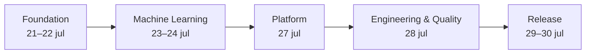

# Software Design Document (SDD)

# SDD-10 · Release Plan

| Campo | Valor |
|---|---|
| Proyecto | TalentCare |
| Documento | Release Plan |
| Código | SDD-10 |
| Versión | 1.0 |
| Estado | Draft |
| Línea base | 23 de julio de 2026 |
| Entrega final | 30 de julio de 2026 |
| Capacidad | 2 sprints · 8 días laborables |

**Semáforo:** 🟢 Completado · 🟡 En progreso · 🔴 Pendiente

---

## 1. Objetivo

Entregar un MVP funcional, evaluado, desplegable y defendible de TalentCare el 30 de julio de 2026, priorizando la rúbrica esencial y media antes de ampliar el nivel avanzado.

---

## 2. Estado del proyecto

### 2.1 Documentación

| Documento | Estado | Evidencia / siguiente paso |
|---|---|---|
| SDD-00 · Scope | 🟡 En progreso | Alcance actualizado; requiere aprobación |
| SDD-00A · Use Cases | 🟡 En progreso | UC-01 a UC-09 actualizados; requiere aprobación |
| SDD-01 · Requirements | 🟡 En progreso | Catálogo actualizado; decisiones críticas pendientes |
| SDD-02 · Architecture | 🟡 En progreso | Arquitectura objetivo definida; implementación pendiente |
| SDD-03 · Implementation Structure | 🟡 En progreso | Alineado con el árbol actual; placeholders identificados |
| SDD-04 · Data Pipeline | 🟡 En progreso | Flujo actualizado; armonización y artefactos pendientes |
| SDD-05 · Modeling | 🔴 Pendiente | Target, clases y métricas contradicen decisiones abiertas |
| SDD-06 · Frontend | 🔴 Pendiente | React documentado; la rúbrica exige resolver Streamlit |
| SDD-07 · API | 🔴 Pendiente | Contrato no validado y backend vacío |
| SDD-08 · Testing | 🔴 Pendiente | Estrategia declarada; archivos de tests vacíos |
| SDD-09 · Deployment | 🔴 Pendiente | Contenedores y configuración vacíos |
| SDD-10 · Release Plan | 🟡 En progreso | Creado; pendiente de validación del equipo |

### 2.2 Entregables

| Área | Estado | Evidencia |
|---|---|---|
| EDA | 🟡 En progreso | Notebook existente; ejecución y conclusiones por validar |
| Pipeline de datos | 🟡 En progreso | Ingesta y transformaciones parciales |
| Modelo y métricas | 🔴 Pendiente | Entrenamiento, evaluación y artefactos vacíos |
| Streamlit | 🔴 Pendiente | Sin implementación ni dependencia |
| Feedback y base de datos | 🔴 Pendiente | Sin decisión ni implementación |
| Tests | 🔴 Pendiente | Cinco archivos placeholder |
| Docker y despliegue | 🔴 Pendiente | Dockerfiles y Compose vacíos |
| CI | 🟡 En progreso | Workflow Python existente; tests aún vacíos |
| Informe, presentaciones y demo | 🔴 Pendiente | Sin entregables verificables |

---

## 3. Roadmap

| Hito | Fecha límite | Criterio de salida |
|---|---|---|
| Foundation | 22 jul | Dataset, target candidato, pipeline y EDA reproducibles |
| Machine Learning | 24 jul | Modelo evaluado, ensemble, métricas y artefacto |
| Platform | 27 jul | Streamlit integrado, feedback y persistencia mínima decidida |
| Engineering & Quality | 28 jul | Tests, Docker e integración ejecutables |
| Release Candidate | 29 jul | Despliegue, informe, README y presentaciones |
| Final Release | 30 jul | Checklist cerrada, demo ensayada y defensa preparada |

---

## 4. Épicas

| Epic | Objetivo | Entregables | Estado |
|---|---|---|---|
| EPIC Foundation | Cerrar decisiones y datos reproducibles | Dataset aprobado, EDA, pipeline y SDD sincronizados | 🟡 En progreso |
| EPIC Machine Learning | Obtener evidencia de rendimiento | Baseline, multiclase validado, ensemble, métricas, XAI y error analysis | 🔴 Pendiente |
| EPIC Platform | Habilitar uso del MVP | Streamlit, inferencia de nuevos datos, feedback y persistencia mínima | 🔴 Pendiente |
| EPIC Engineering | Asegurar ejecución repetible | Tests, CI útil, Docker y configuración | 🔴 Pendiente |
| EPIC Delivery | Preparar entrega y defensa | Despliegue, informe, README, presentaciones y demo | 🔴 Pendiente |

---

## 5. Sprint 1 · Foundation + Machine Learning

**Periodo:** 21–24 de julio · **Objetivo:** cerrar la base de datos/modelado y producir un artefacto evaluado.

| Historia | Tareas | Entregable | Dependencias | Estado |
|---|---|---|---|---|
| S1-01 · Freeze de datos | RP-01, RP-02 | Decisión de dataset, target y pipeline reproducible | SDD-04; SDD-05 | 🟡 En progreso |
| S1-02 · EDA verificable | RP-03 | Notebook ejecutado y conclusiones | S1-01 | 🟡 En progreso |
| S1-03 · Baseline y evaluación | RP-04, RP-05 | Baseline, splits, métricas y matriz de confusión | S1-01 | 🔴 Pendiente |
| S1-04 · Modelo candidato | RP-06, RP-07, RP-08 | Ensemble optimizado, XAI, errores y pipeline persistido | S1-03 | 🔴 Pendiente |

**Definition of Done del sprint**

- [ ] Dataset y variable objetivo aprobados o limitación formalmente registrada.
- [ ] EDA ejecutable y reproducible.
- [ ] Train, validation y test separados sin leakage.
- [ ] Accuracy, precision, recall y F1 documentados.
- [ ] Brecha de overfitting inferior al 5 % según el criterio acordado.
- [ ] Artefacto cargable sobre datos nuevos.

---

## 6. Sprint 2 · Platform + Engineering + Delivery

**Periodo:** 27–30 de julio · **Objetivo:** integrar, validar, desplegar y preparar la defensa.

| Historia | Tareas | Entregable | Dependencias | Estado |
|---|---|---|---|---|
| S2-01 · Aplicación | RP-09 | Streamlit conectado al pipeline | S1-04 | 🔴 Pendiente |
| S2-02 · Feedback y datos | RP-10, RP-11 | Feedback y base de datos mínima | S2-01; decisión de persistencia | 🔴 Pendiente |
| S2-03 · Calidad | RP-12, RP-13 | Suite crítica y contenedor ejecutable | S2-01 | 🔴 Pendiente |
| S2-04 · Release Candidate | RP-14, RP-15, RP-16 | Despliegue, informe, README y presentaciones | S2-03 | 🔴 Pendiente |
| S2-05 · Final Release | RP-17, RP-18 | Repositorio cerrado y demo ensayada | S2-04 | 🔴 Pendiente |

**Definition of Done del sprint**

- [ ] Flujo Streamlit → inferencia → resultado funciona.
- [ ] Feedback, persistencia y manejo de errores están validados.
- [ ] Tests y Docker se ejecutan desde un entorno limpio.
- [ ] Release Candidate está desplegada.
- [ ] Informe, presentaciones y demo están aprobados por el equipo.

---

## 7. Cronograma laboral

| Fecha | Sprint | Objetivo del día | Salida esperada | Estado |
|---|---|---|---|---|
| Mar 21 jul | Sprint 1 | Cerrar dataset, target candidato y criterios | Decisión registrada | 🔴 Pendiente |
| Mié 22 jul | Sprint 1 | Consolidar pipeline y EDA | Datos reproducibles y notebook validado | 🔴 Pendiente |
| Jue 23 jul | Sprint 1 | Baseline, split y métricas | Benchmark y brecha de overfitting | 🟡 En progreso |
| Vie 24 jul | Sprint 1 | Ensemble, optimización y XAI | Pipeline seleccionado y persistido | 🔴 Pendiente |
| Lun 27 jul | Sprint 2 | Integrar Streamlit y nuevos datos | MVP navegable | 🔴 Pendiente |
| Mar 28 jul | Sprint 2 | Feedback, base de datos, tests y Docker | Build integrado verificable | 🔴 Pendiente |
| Mié 29 jul | Sprint 2 | Desplegar y cerrar materiales | Release Candidate y presentaciones | 🔴 Pendiente |
| Jue 30 jul | Sprint 2 | Regresión, ensayo y defensa | Final Release | 🔴 Pendiente |

No se planifica trabajo los días 25 y 26 de julio.

---

## 8. Matriz de cumplimiento de la rúbrica

| Nivel | Requisito | Epic | Sprint | Entregable | Estado |
|---|---|---|---|---|---|
| Esencial | Modelo multiclase | Machine Learning | 1 | Modelo validado contra clases aprobadas | 🔴 Pendiente |
| Esencial | EDA | Foundation | 1 | Notebook ejecutado y conclusiones | 🟡 En progreso |
| Esencial | Overfitting <5 % | Machine Learning | 1 | Comparación train/validation/test | 🔴 Pendiente |
| Esencial | Streamlit | Platform | 2 | Aplicación funcional | 🔴 Pendiente |
| Esencial | Accuracy | Machine Learning | 1 | Informe de métricas | 🔴 Pendiente |
| Esencial | Precision | Machine Learning | 1 | Informe de métricas | 🔴 Pendiente |
| Esencial | Recall | Machine Learning | 1 | Informe de métricas | 🔴 Pendiente |
| Esencial | F1 | Machine Learning | 1 | Informe de métricas | 🔴 Pendiente |
| Esencial | Matriz de confusión | Machine Learning | 1 | Matriz y lectura de errores | 🔴 Pendiente |
| Esencial | Feature Importance | Machine Learning | 1 | Evidencia explicativa | 🔴 Pendiente |
| Esencial | Error Analysis | Machine Learning | 1 | Informe por clase y casos de fallo | 🔴 Pendiente |
| Medio | Ensemble | Machine Learning | 1 | Comparación con modelos individuales | 🔴 Pendiente |
| Medio | Cross Validation | Machine Learning | 1 | Resultados reproducibles | 🔴 Pendiente |
| Medio | Optimización | Machine Learning | 1 | Búsqueda y configuración elegida | 🔴 Pendiente |
| Medio | Feedback | Platform | 2 | Captura y tratamiento mínimo | 🔴 Pendiente |
| Medio | Pipeline para nuevos datos | Foundation | 1 | Artefacto de transformación e inferencia | 🔴 Pendiente |
| Avanzado | Docker | Engineering | 2 | Imagen o composición ejecutable | 🔴 Pendiente |
| Avanzado | Base de datos | Platform | 2 | Persistencia mínima validada | 🔴 Pendiente |
| Avanzado | Despliegue | Delivery | 2 | URL o entorno demostrable | 🔴 Pendiente |
| Avanzado | Tests | Engineering | 2 | Suite crítica ejecutada | 🔴 Pendiente |

El nivel experto es opcional y no consume capacidad hasta cerrar los niveles esencial, medio y avanzado.

---

## 9. Release Checklist

### Producto y datos

- [ ] Alcance, dataset, target y clases están aprobados.
- [ ] EDA y pipeline son reproducibles.
- [ ] El MVP procesa datos nuevos.
- [ ] Streamlit presenta resultado y limitaciones.
- [ ] Feedback y persistencia mínima funcionan.

### Modelo y calidad

- [ ] Baseline, candidatos y ensemble están comparados.
- [ ] Accuracy, precision, recall y F1 están documentados.
- [ ] Overfitting <5 %, matriz de confusión y error analysis están verificados.
- [ ] Feature importance acompaña al resultado.
- [ ] Tests críticos y CI pasan.

### Operación y entrega

- [ ] Docker se construye y ejecuta.
- [ ] El despliegue está accesible o reproducible.
- [ ] No hay secretos, artefactos temporales ni cambios ajenos.
- [ ] README, SDD e informe reflejan el estado real.
- [ ] Presentaciones y demo usan la misma Release Candidate.

---

## 10. Riesgos

| ID | Riesgo | Exposición | Impacto | Mitigación |
|---|---|---|---|---|
| R-01 | Ocho días laborables y múltiples entregables vacíos | 🔴 Alta | Entrega incompleta | Limitar WIP y cerrar esencial antes de avanzado |
| R-02 | Dataset, target y clases sin aprobar | 🔴 Alta | Bloquea ML y plataforma | Gate de decisión inmediato en RP-01 |
| R-03 | Multiclase de rúbrica frente a estrategia pendiente | 🔴 Alta | Incumplimiento o modelo inválido | Validar clases y registrar reconciliación |
| R-04 | Streamlit exigido frente a React documentado | 🔴 Alta | Duplicación de frontend | Elegir Streamlit para entrega y sincronizar SDD |
| R-05 | Código, modelos y tests son mayoritariamente placeholders | 🔴 Alta | MVP no ejecutable | Integración vertical mínima antes de ampliar |
| R-06 | Base de datos no pertenece al flujo base aprobado | 🟡 Media | Scope creep | Persistencia mínima aislada y time-boxed |
| R-07 | CI puede pasar con tests vacíos | 🟡 Media | Falsa confianza | Exigir asserts y casos críticos antes de aceptar |
| R-08 | SDD-05 a SDD-09 contradicen fuentes actuales | 🟡 Media | Trabajo inconsistente | Actualización dirigida por entregable |

---

## 11. Out of Scope

- Nivel experto de la rúbrica.
- Autenticación, perfiles persistentes e integraciones corporativas.
- Aplicación móvil o agente conversacional.
- Entrenamiento continuo y MLOps completo.
- Monitorización avanzada y gestión de múltiples modelos.

Estos elementos no bloquean la defensa.

---

## 12. Task Board

| ID | Task | Epic | Sprint | Prioridad | Estado |
|---|---|---|---|---|---|
| RP-01 | Aprobar dataset, target candidato y estrategia de clases | Foundation | 1 | Must | 🟡 En progreso |
| RP-02 | Consolidar ingesta, validación, split y transformadores | Foundation | 1 | Must | 🟡 En progreso |
| RP-03 | Ejecutar y cerrar el EDA | Foundation | 1 | Must | 🟡 En progreso |
| RP-04 | Entrenar baseline y modelo multiclase validado | Machine Learning | 1 | Must | 🔴 Pendiente |
| RP-05 | Calcular métricas, matriz y overfitting | Machine Learning | 1 | Must | 🔴 Pendiente |
| RP-06 | Ejecutar cross validation y optimización | Machine Learning | 1 | Must | 🔴 Pendiente |
| RP-07 | Entrenar ensemble y seleccionar modelo | Machine Learning | 1 | Must | 🔴 Pendiente |
| RP-08 | Generar feature importance, error analysis y artefacto | Machine Learning | 1 | Must | 🔴 Pendiente |
| RP-09 | Implementar e integrar Streamlit | Platform | 2 | Must | 🔴 Pendiente |
| RP-10 | Incorporar feedback | Platform | 2 | Should | 🔴 Pendiente |
| RP-11 | Implementar persistencia mínima | Platform | 2 | Should | 🔴 Pendiente |
| RP-12 | Implementar tests críticos y validar CI | Engineering | 2 | Must | 🔴 Pendiente |
| RP-13 | Dockerizar el MVP | Engineering | 2 | Must | 🔴 Pendiente |
| RP-14 | Desplegar la Release Candidate | Delivery | 2 | Must | 🔴 Pendiente |
| RP-15 | Cerrar README e informe técnico | Delivery | 2 | Must | 🔴 Pendiente |
| RP-16 | Preparar presentaciones de negocio y técnica | Delivery | 2 | Must | 🔴 Pendiente |
| RP-17 | Cerrar GitHub, Trello y documentación | Delivery | 2 | Must | 🔴 Pendiente |
| RP-18 | Ejecutar regresión, ensayo de demo y defensa | Delivery | 2 | Must | 🔴 Pendiente |

---

## 13. Definition of Done final

- [ ] Repositorio limpio.
- [ ] Modelo funcional.
- [ ] Overfitting <5 %.
- [ ] EDA completo.
- [ ] Informe técnico.
- [ ] Presentación de negocio.
- [ ] Presentación técnica.
- [ ] Streamlit funcional.
- [ ] Docker funcional.
- [ ] GitHub actualizado.
- [ ] Trello actualizado.
- [ ] Documentación sincronizada.
- [ ] Tests y CI superados.
- [ ] Despliegue verificable.
- [ ] Demo preparada y ensayada.
